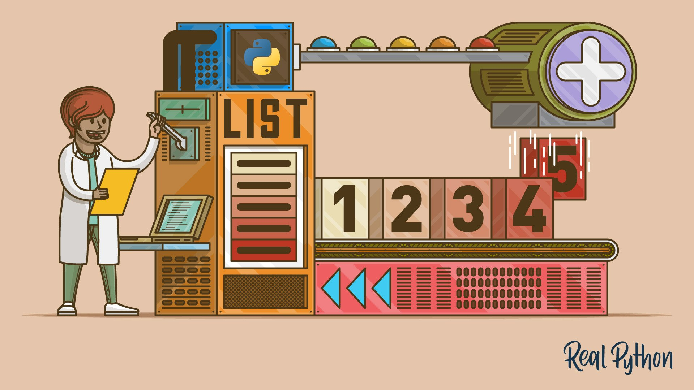
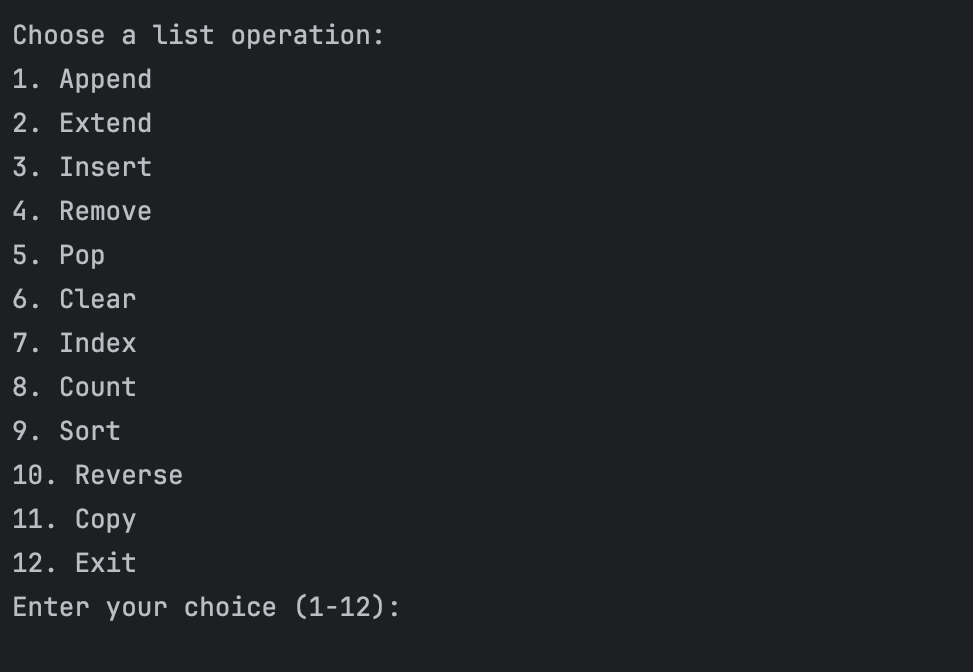

# Python List Methods System Project 📋

  

## ℹ️ About The Project 
This is a console-based application that allows users to perform various operations on a list. The application present a menu of options, each corresponding to a different list method. Users can choose an option by entering a number, and the application execute the corresponding list method.

## 💻 Tech stack:

 

## ✅ Functions that the system provide: 
* Add an element at the end of the list. 
* Add elements of a list (or any iterable), to the end of the current list.
* Add an element at the specified position.
* Remove the first item with the specified value.
* Remove the element at the specified position.
* Remove all items from the list.
* Find the index of the first element with the specified value.
* Find the number of elements with the specified value.
* Sort the list.
* Reverse the order of the list.
* Make a copy of the list.

## ⁉️ How to use?

When the program starts, the user is prompted to enter values (separated by commas) that will initially be part of the list. If the input is incorrect, the user must re-enter the data, and this procedure continues until the initial values are correctly entered as elements of the list.

After initializing the initial list, a menu appears in the console, consisting of various options from which the user can choose for subsequent list manipulation. The options available are as follows:

1. Append ➕
2. Extend 📝
3. Insert ✒️
4. Remove ✖️
5. Pop ✂️
6. Clear 🧹
7. Index 🔍
8. Count 🔢
9. Sort ⬇️
10. Reverse ⬆️ 
11. Copy 📇
12. Exit

When selecting the 1. Append operation, the user must enter the element they wish to add to the list. The new element is added to the end of the list, and the updated list is printed on the screen.

When selecting the 2. Extend operation, the user must enter the elements they wish to add to the list, separated by commas. If the data entry is incorrect, the user is prompted to re-enter it until it is correctly done. Once the data is correctly entered, it is added to the existing list. The updated list is then printed on the screen.

When selecting the 3. Insert operation, the user must enter the element they wish to add to the list, and subsequently the index at which they want the element to be inserted. If the entered index is incorrect (out of the list's boundaries), the user must continue entering indexes until a correct one is provided. After successfully adding the desired element at the specific position, the updated list is printed on the screen.

When selecting the 4. Remove operation, the user must enter the element they wish to remove. If the element is part of the list, it is removed and the updated list is printed on the screen. Otherwise, a message is displayed stating that the element to be removed is not part of the list.

When selecting the 5. Pop operation, the user must enter the index of the element they wish to remove from the list or press enter if they wish to remove the last element of the list. If the list is already empty, the user receives a message indicating this, or if the selected index is not part of the list. After performing the removal operation, the updated list is printed on the screen.

When selecting the 6. Clear operation, all elements from the list are removed, and the cleared list is printed on the screen.

When selecting the 7. Index operation, the user must enter the element whose index they wish to find out. If the element is not part of the list, an appropriate message is displayed. If the element is part of the list, the index of the first occurrence of the element is printed.

When selecting the 8. Count operation, the user must enter the element whose count they wish to find out. The number of times the specific element appears in the list is printed on the screen.

When selecting the 9. Sort operation, the list is sorted in ascending order, and the sorted list is printed on the screen.

When selecting the 10. Reverse operation, the list is sorted in descending order, and the sorted list is printed on the screen.

When selecting the 11. Copy operation, a copy of the list is created and printed on the screen.

When selecting the 12. Exit operation, the program terminates.

## 🧑‍💻 User Menu:

  

